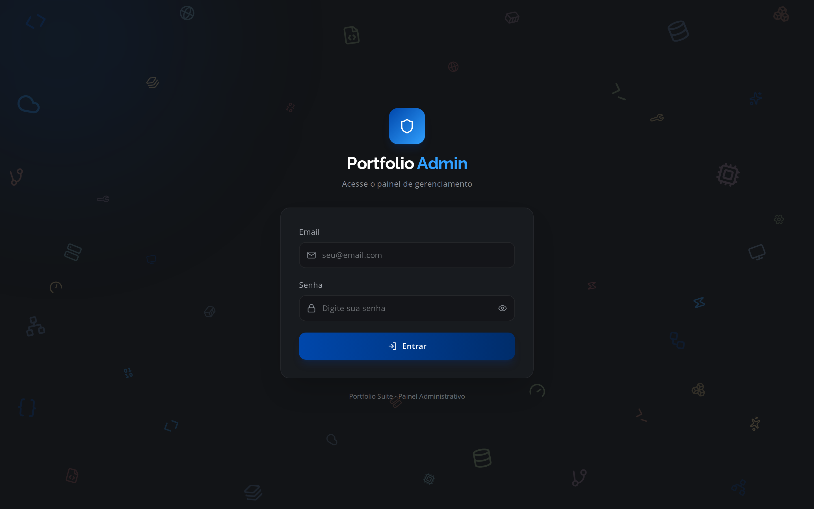
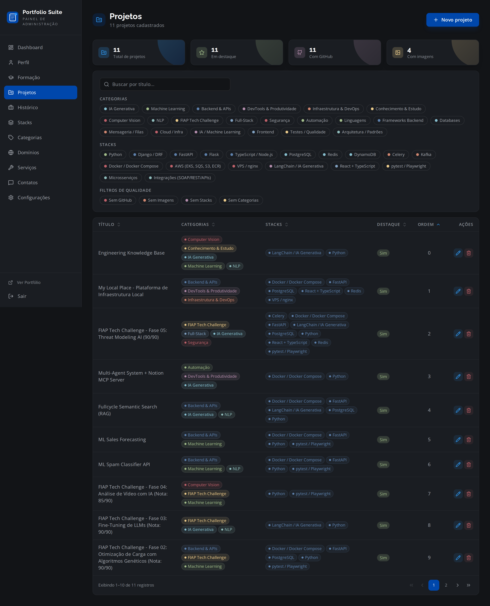
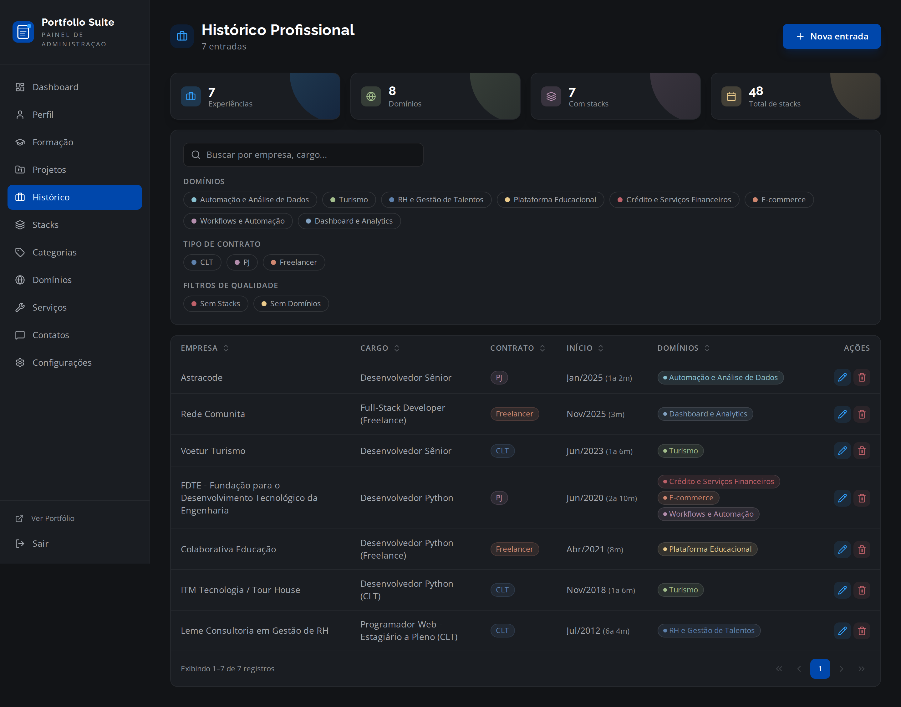
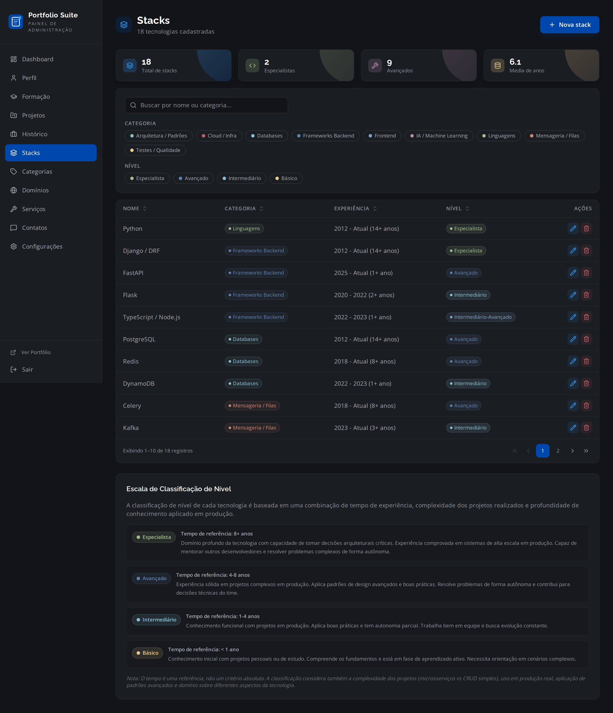
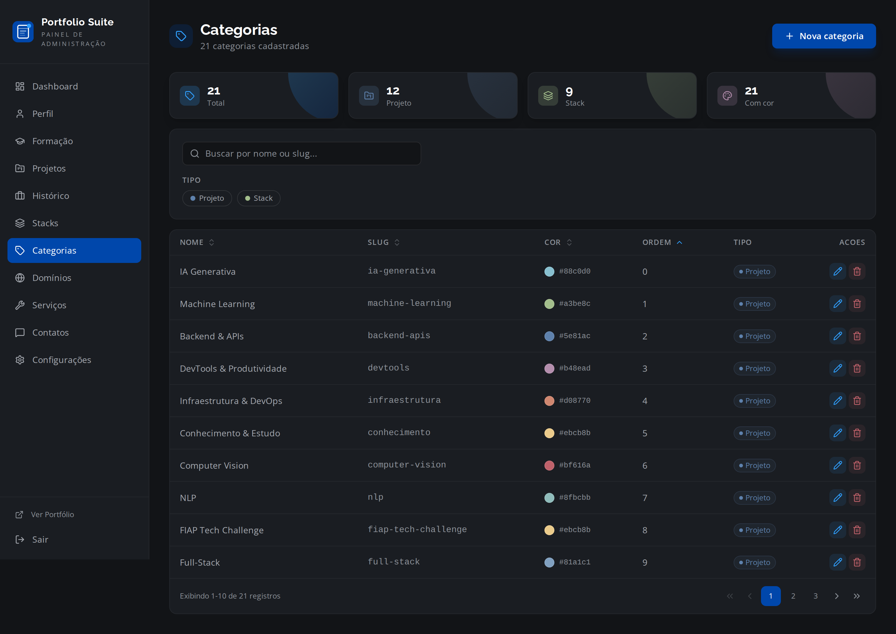

# Portfolio Suite

Portfolio profissional completo com painel administrativo, construido com Node.js (Express + Prisma + PostgreSQL) e React 19 (Vite + Tailwind CSS). Deploy em VPS com Docker Compose e nginx.

## Screenshots

### Admin Dashboard


### Login


### Projetos


### Historico Profissional


### Stacks & Tecnologias


### Categorias


## Stack

### Backend
- **Node.js 18** + Express
- **Prisma ORM** + PostgreSQL 16
- **JWT** para autenticacao
- **Zod** para validacao de schemas
- **Multer** para upload de arquivos

### Frontend
- **React 19** + TypeScript
- **Vite** para build
- **Tailwind CSS** com tema Nord
- **Lucide React** para icones
- **React Router** para navegacao SPA

### Infraestrutura
- **Docker Compose** para desenvolvimento e producao
- **nginx** como reverse proxy (producao)
- **PostgreSQL 16** Alpine

## Funcionalidades

### Portfolio Publico (4 paginas)
- **Landing Page** - Hero, About, Servicos, Formulario de contato
- **Projetos & Formacao** - 11 projetos com carrossel de imagens, 4 formacoes
- **Historico Profissional** - Timeline expandivel com stats dinamicos, filtros por dominio
- **Stacks & Ferramentas** - 18 tecnologias com detalhamento, filtro por categoria

### Painel Administrativo (12 paginas)
- **Dashboard** - Graficos interativos (pizza, barras horizontais), indicadores de saude, atividade recente
- **Projetos** - CRUD com filtros server-side, categorias e stacks many-to-many, upload de imagens
- **Historico** - CRUD com stacks e dominios aninhados, tipo de contrato, duracao calculada
- **Stacks** - CRUD com categoria FK, startYear/endYear, niveis (Especialista/Avancado/Intermediario/Basico)
- **Categorias** - CRUD com filtro por tipo (Projeto/Stack), cores e icones
- **Dominios** - CRUD de dominios de atuacao com cores
- **Servicos** - CRUD de especialidades
- **Contatos** - CRUD de links sociais e contatos com filtro por tipo
- **Formacao** - CRUD de educacao/certificacoes
- **Perfil** - Upload de avatar, bio, SEO, configuracao de secoes
- **Configuracoes** - Paleta de cores, tipografia, SMTP configuravel
- **Login** - Autenticacao JWT com interface moderna

### Backend (14+ endpoints)
- Auth, Profile, Projects, Career, Stacks, Categories, Domains, Services, Contacts, Education, Settings, Stats, Assets

### Features Tecnicas
- Reordenacao automatica (`reorderOnSave`) em todos os cadastros com campo `order`
- Stats dinamicos via `/api/stats/public`
- Filtros server-side com busca, paginacao e ordenacao em todas as telas admin
- SMTP configuravel via painel admin
- Upload de imagens com servico de assets

## Como Rodar

### Desenvolvimento
```bash
docker compose up -d
```
- Frontend: http://localhost:5173
- Backend: http://localhost:3001
- Database: localhost:5434

### Producao
```bash
docker compose -f docker-compose.prod.yml up -d --build
```

## Estrutura do Projeto

```
portfolio-suite/
  backend/
    src/
      controllers/    # 12 controllers (Auth, Profile, Project, Career, Stack, ...)
      repositories/   # Repository pattern com Prisma
      routes/         # Express routes
      schemas/        # Zod validation schemas
      utils/          # JWT, password, reorder, slug
    prisma/
      schema.prisma   # 17 models
      seed.ts         # Seed completo com dados reais
  frontend/
    src/
      components/     # Header, Hero, Footer, ContactForm, ...
      pages/
        admin/        # 12 paginas admin
        *.tsx          # 4 paginas publicas
      hooks/          # useStacks, useStats, useTheme
      services/       # API client
  nginx/              # Configuracao nginx (prod)
  configs/            # Environment files
  assets/
    screenshots/      # Screenshots do admin
```

## Modelos de Dados

- **User** - Autenticacao e perfil
- **Profile** - Bio, SEO, configuracoes visuais
- **Project** - Projetos com imagens, categorias e stacks (many-to-many)
- **CareerEntry** - Historico com stacks e dominios (many-to-many)
- **StackDetail** - Tecnologias com categoria FK, nivel, startYear/endYear
- **Category** - Categorias de projetos e stacks com cores
- **Domain** - Dominios de atuacao profissional
- **Education** - Formacao academica
- **Service** - Especialidades/servicos oferecidos
- **ContactInfo** - Links sociais e contatos
- **SiteSettings** - Cores, fontes, SMTP, textos de paginas

## Licenca

Privado - Lucas Biason
