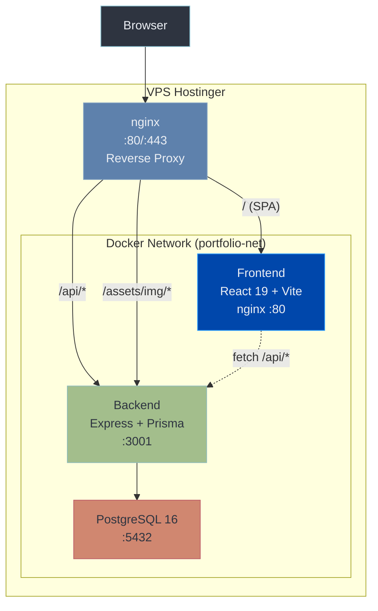
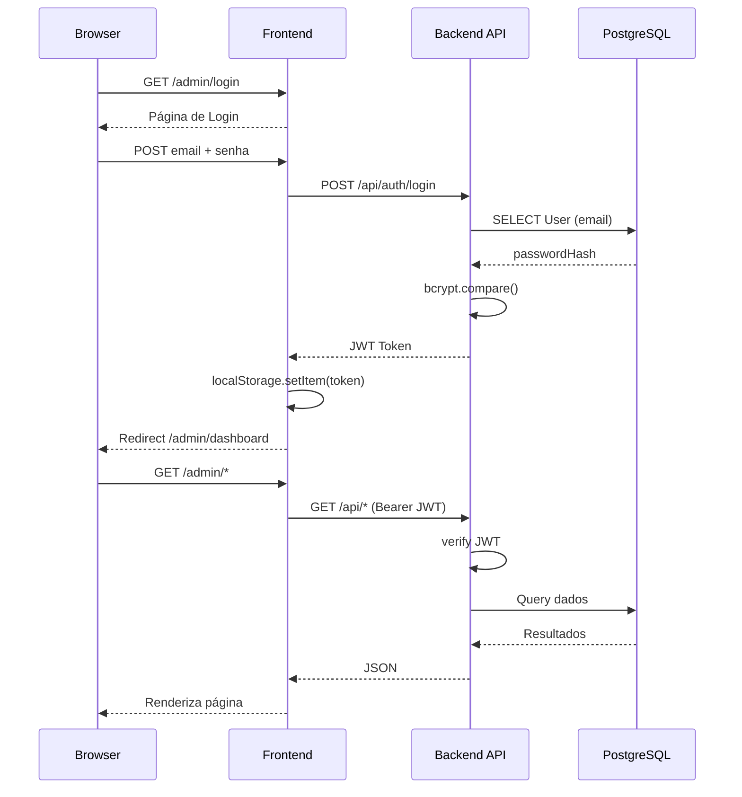
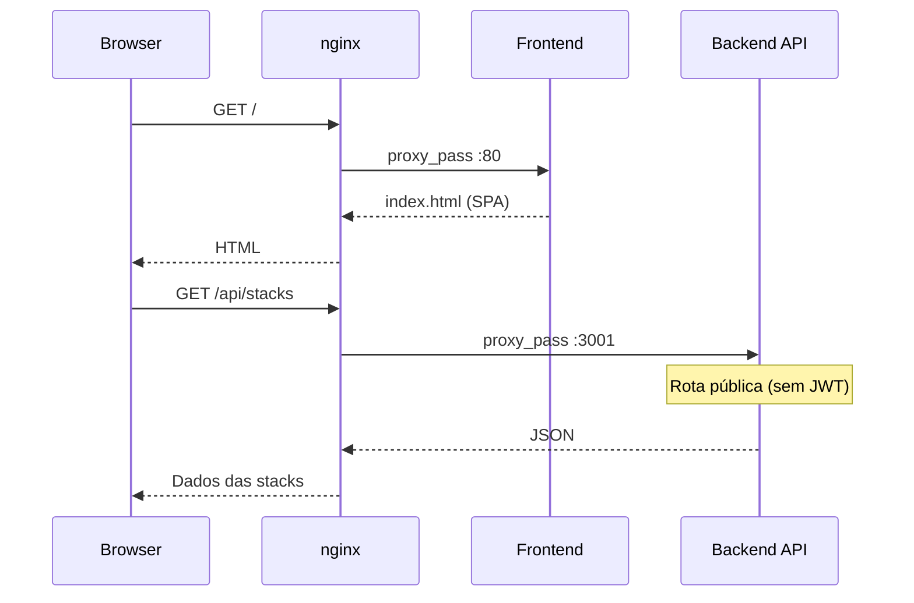

# Arquitetura - Portfolio Suite

## Visão Geral



## Fluxo de Autenticação



## Fluxo Público (sem autenticação)



## Componentes

### Frontend (React 19 + TypeScript + Vite)
- **Páginas públicas**: Landing, Projetos, Histórico, Stacks
- **Painel Admin**: 12 páginas com CRUD completo
- **Autenticação**: JWT salvo em localStorage
- **Temas**: Cores dinâmicas via CSS custom properties

### Backend (Node.js + Express + Prisma)
- **17 modelos** no Prisma schema
- **14+ endpoints** REST
- **JWT** para autenticação de rotas admin
- **Rotas públicas** sem auth para portfólio
- **Upload de arquivos** via Multer
- **Reordenação automática** (`reorderOnSave`)

### Banco de Dados (PostgreSQL 16)
- **Relações many-to-many**: ProjectCategory, ProjectStack, CareerStack, CareerDomain
- **FK**: StackDetail -> Category
- **Diagrama completo**: `docs/database.dbml`

### Infraestrutura
- **Docker Compose** para dev e produção
- **nginx** como reverse proxy (produção)
- **Variáveis de ambiente** em `configs/.env` (gitignored)
- **Multi-serviço**: nginx roteia também para outros projetos no mesmo VPS

## Deployment

```bash
# Produção (VPS)
docker compose -f docker-compose.prod.yml up -d --build

# Desenvolvimento (local)
docker compose up -d
```

### Portas
| Serviço | Dev | Produção |
|---------|-----|----------|
| Frontend | 5173 | 80 (via nginx) |
| Backend | 3001 | 3001 (interno) |
| Database | 5434 | 5432 (interno) |
| nginx | - | 80/443 |
